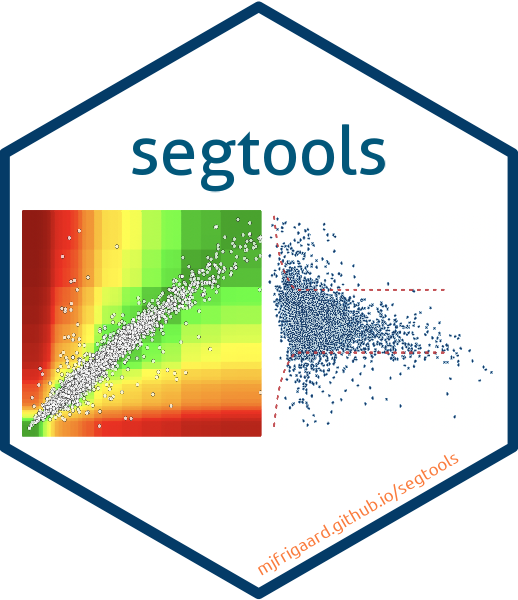

<!-- README.md is generated from README.Rmd. Please edit that file -->

```{r setup, include = FALSE}
knitr::opts_chunk$set(
  collapse = TRUE,
  comment = "#>",
  eval = TRUE,
  warning = FALSE,
  message = FALSE,
  dev = "ragg_png",
  out.width = "100%",
  fig.width = 8,
  fig.retina = 2,
  fig.path = "man/figures/"
  # fig.asp = 0.618,
  # dpi = 240
)
# import font ----
if (!requireNamespace('pak')) {
    install.packages('pak', repos = 'https://r-lib.github.io/p/pak/dev/')
}
# ext_pkgs <- c('dplyr', 'vroom', 'janitor', 'extrafont', 'sysfonts', 'showtext')
# pak::pkg_install(ext_pkgs)

library(extrafont)
extrafont::loadfonts(quiet = TRUE)
extrafont::font_import(
    paths = "inst/assets/Ubuntu/",
    prompt = FALSE)
# add font ----
sysfonts::font_add(
    family =  "Ubuntu", 
    regular = "inst/assets/Ubuntu/Ubuntu-Regular.ttf")
# if necessary: 
# remotes::install_github("yixuan/showtext", force = TRUE)
library(showtext)
# add Arial
sysfonts::font_add("Arial", "/Library/Fonts/Arial.ttf")
showtext::showtext_auto()
```

<br>

```{r package_hex, echo=FALSE, out.width='20%', fig.align='right'}

```

<br>

# segtools

<!-- badges: start -->

<!-- badges: end -->

`segtools` provides the underlying functions and calculations for [The Surveillance Error Grid](https://www.diabetestechnology.org/seg.shtml) shiny application. 

For more information, see the original paper:

Klonoff, David C., Courtney Lias, Robert Vigersky, William Clarke, Joan Lee Parkes, David B. Sacks, M. Sue Kirkman, et al. 2014. "*The Surveillance Error Grid.*" Journal of Diabetes Science and Technology 8 (4): 658–72. [https://doi.org/10.1177/1932296814539589](https://doi.org/10.1177/1932296814539589)


## Installation

You can install the development version of `segtools` from [GitHub](https://github.com/) with:

``` r
# install.packages("remotes")
remotes::install_github("mjfrigaard/segtools")
```

## Previous work

The previous shiny applications are stored in the [Quesgen GitHub repositories](https://github.com/quesgen):

-   [Version 1.3.2](https://github.com/quesgen/seg-shiny-1-3-2)

-   [Version 1.3.3](https://github.com/quesgen/seg-shiny-1-3-3)

## SEG Graph

The SEG graph can be created from a dataset with `BGM` and `REF` values:

```{r example}
library(segtools)
library(vroom)
# import data
test_data <- vroom::vroom(
  file =
    system.file("extdata", "VanderbiltComplete.csv",
        package = "segtools"), delim = ",")
# plot
segtools::seg_graph(
  data = test_data
)
```

Read more [here](https://www.diabetestechnology.org/seg.shtml).
