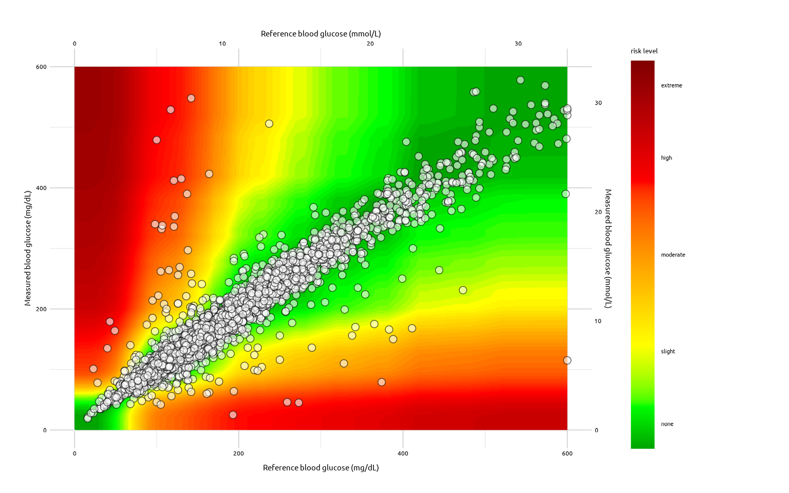

<!-- README.md is generated from README.Rmd. Please edit that file -->

# segtools

<!-- badges: start -->
<!-- badges: end -->

`segtools` provides the underlying functions and calculations for the
[SURVEILLANCE ERROR GRID
(SEG)](https://www.diabetestechnology.org/seg.shtml)

## Installation

You can install the development version of `segtools` from
[GitHub](https://github.com/) with:

``` r
# install.packages("devtools")
devtools::install_github("mjfrigaard/segtools")
```

## SEG Graph

The SEG graph can be created from a dataset with `BGM` and `REF` values:

``` r
library(segtools)
library(vroom)
# import data
test_data <- vroom::vroom(
  file =
    system.file("extdata", "AppTestData.csv",
        package = "segtools"), delim = ",")
# plot
segtools::seg_grid(
  data = test_data,
  is_path = FALSE,
  alpha_var = 3 / 4,
  size_var = 2.5,
  color_var = "gray85"
)
```



Read more [here](https://www.diabetestechnology.org/seg.shtml).
