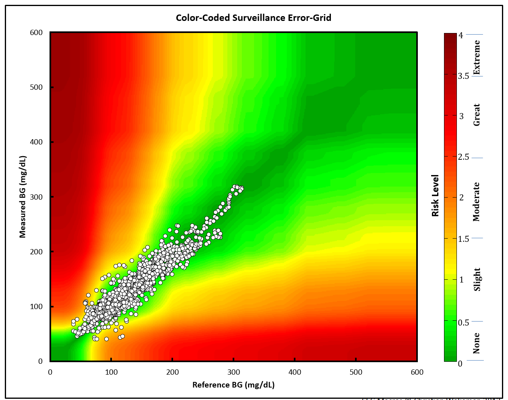

```{r setup, include = FALSE, results='hide'}
knitr::opts_chunk$set(
  collapse = TRUE,
  comment = "#>",
  dev = "ragg_png",
  dpi = 320,
  fig.asp = 0.718,
  # fig.asp = 0.618,
  fig.retina = 0.4,
  out.width = "100%",
  fig.width = 8,
  fig.path = "../man/figures/",
  eval = TRUE,
  warning = FALSE,
  message = FALSE
)
# colourpicker install
# devtools::install_github("daattali/colourpicker", force = TRUE, quiet = TRUE)
# import font ----
library(extrafont)
extrafont::loadfonts(quiet = TRUE)
extrafont::font_import(
    paths = "../inst/assets/Ubuntu/",
    prompt = FALSE)
# add font ----
sysfonts::font_add(
    family =  "Ubuntu", 
    regular = "../inst/assets/Ubuntu/Ubuntu-Regular.ttf")
# if necessary: 
# remotes::install_github("yixuan/showtext", force = TRUE)
library(showtext)
# add Arial
# sysfonts::font_add("Arial", "/Library/Fonts/Arial.ttf")
showtext::showtext_auto()
```

```{r pkgs, message=FALSE, warning=FALSE}
library(segtools)
library(dplyr)
library(ggplot2)
```

# Motivating problem/issue

In earlier versions of the application, the heat-map background wasn’t smoothed like the original Excel application. This file documents how I changed the SEG graph using a pre-made `.png` image.

## Data

To create the `SEG` using `ggplot`, I need to load a few data
inputs from [Github.](https://github.com/mjfrigaard/seg-shiny-data). I can do this with the `segtools::get_seg_data()` function in the code chunk below:

1.  `risk_pairs` -\> this assigns a risk factor value to each BGM
    measurement
2.  `samp_measured_data` -\> this is a small sample measurement dataset
3.  `vand_data` -\> this is a dataset from Vanderbilt used to create
    some of the initial calculations
    
```{r get_seg_data}
segtools::get_seg_data("names")
```

```{r import}
risk_pairs <- segtools::get_seg_data("AppRiskPairData")
samp_measured_data <- segtools::get_seg_data("FullSampleData")
vand_data <- segtools::get_seg_data("VanderbiltComplete")
```

```{r mmolConvFactor}
mmolConvFactor <- segtools::mmolConvFactor
mmolConvFactor
```

```{r risk_factor_colors}
risk_factor_colors <- segtools::risk_factor_colors
```


```{r base_data}
base_data <- segtools::base_data
base_data
```

`risk_pairs` has columns and risk pairs for both `REF` and `BGM`, and the `RiskFactor` variable for each pair of `REF` and `BGM` data. Below you can see a sample of the `REF`, `BGM`, `RiskFactor`, and `abs_risk` variables.

```{r}
risk_pairs |> 
  dplyr::sample_n(size = 10) |>  
  dplyr::select(
    REF, BGM, RiskFactor, abs_risk)
```


`samp_measured_data` mimics a blood glucose monitor, with only `BGM` and `REF` values.

```{r}
samp_measured_data |> 
  dplyr::sample_n(size = 10) |>  
  dplyr::select(
    REF, BGM)
```

`vand_data` contains blood glucose monitor measurements, with only `BGM` and `REF` values.

```{r}
vand_data |>  
  dplyr::sample_n(size = 10) |> 
  dplyr::select(REF, BGM)
```

## The original (Excel) SEG image

Below is the image from the Excel file:

```{r man-SEG_n2083.png, echo=FALSE}
download.file(url = "https://raw.githubusercontent.com/mjfrigaard/seg-shiny-data/master/Image/SEG_n2083.png?raw=true", destfile = "../man/figures/SEG_n2083.png", quiet = TRUE)

```


The points are plotted against a Gaussian smoothed background image.


## `ggplot2` image using risk pairs

The steps/code to create the current `ggplot2` image are below 

### Base layer 

```{r ggp_base}
ggp_base <- ggplot() +
  geom_point(data = base_data, 
    aes(x = x_coordinate,
      y = y_coordinate,
      fill = color_gradient))
ggp_base
```

## Risk color gradient 

The risk layer adds the `risk_pairs` data and creates the color gradient. 

```{r ggp_risk_color_gradient}
ggp_risk_color_gradient <- ggp_base +
  geom_point(data = risk_pairs, 
    aes(x = REF, 
        y = BGM,
        color = abs_risk), show.legend = FALSE)  +
  ggplot2::scale_color_gradientn(
    colors = risk_factor_colors, 
    guide = "none",
    limits = c(0, 4),
    values = scales::rescale(c(
      0, # darkgreen
      0.4375, # green
      1.0625, # yellow
      2.7500, # red
      4.0000)))
ggp_risk_color_gradient
```

## Risk fill gradient

The guide is added with `ggplot2::scale_fill_gradientn()` and `ggplot2::guide_colorbar()`. 

```{r ggp2_risk_fill_gradient}
ggp2_risk_fill_gradient <- ggp_risk_color_gradient +
  ggplot2::scale_fill_gradientn(values = scales::rescale(c(
      0, # darkgreen
      0.4375, # green
      1.0625, # yellow
      2.75, # red
      4.0 # brown
    )), 
    limits = c(0, 4),
    colors = risk_factor_colors,
    guide = ggplot2::guide_colorbar(ticks = FALSE,
                           barheight = unit(100, "mm")),
                           breaks = c(0.25, 1, 2, 3, 3.75),
                           labels = c("None", "Slight", 
                                      "Moderate", "High", "Extreme"),
                           name = "Risk level")
ggp2_risk_fill_gradient
```

## Scales 

The x and y scales are set manually using `ggplot2::scale_y_continuous()` and `ggplot2::scale_x_continuous()`.

```{r ggp_scales}
ggp_scales <- ggp2_risk_fill_gradient +
  ggplot2::scale_y_continuous(
    limits = c(0, 600),
    sec.axis =
      sec_axis(~. / mmolConvFactor,
        name = "Measured blood glucose (mmol/L)"
      ),
    name = "Measured blood glucose (mg/dL)"
  ) +
  ggplot2::scale_x_continuous(
    limits = c(0, 600),
    sec.axis =
      sec_axis(~. / mmolConvFactor,
        name = "Reference blood glucose (mmol/L)"
      ),
    name = "Reference blood glucose (mg/dL)"
  )
ggp_scales
```

## Theme 

Finally, the theme is added to polish the output. 

```{r ggp_seg}
ggp_seg <- ggp_scales + 
  segtools::theme_seg(base_size = 20)
ggp_seg
```

